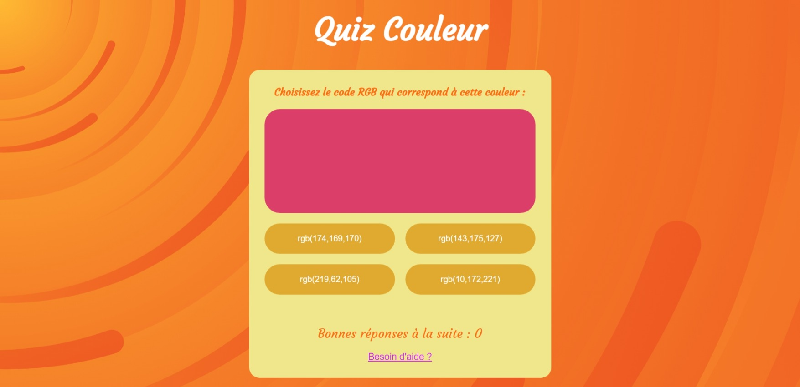

  
  
  

# 🌈 Colors-Quiz❔

## Learn with fun
Colors-Quiz is a small game created during my personal learning to review JavaScript

Languages:
----------
- HTML 5
- CSS 3
- JavaScript

# Overview 🔎

## View Complete Game : ➡️ https://sarah-jpro.github.io/Colors-Quiz/

 
